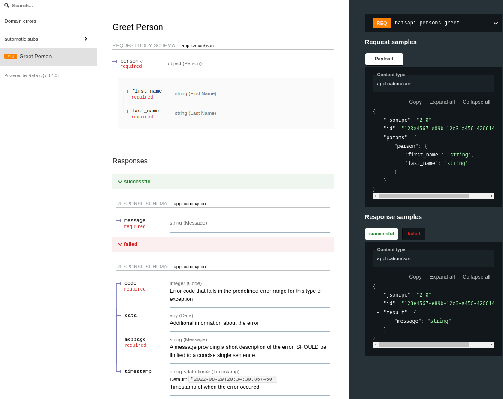
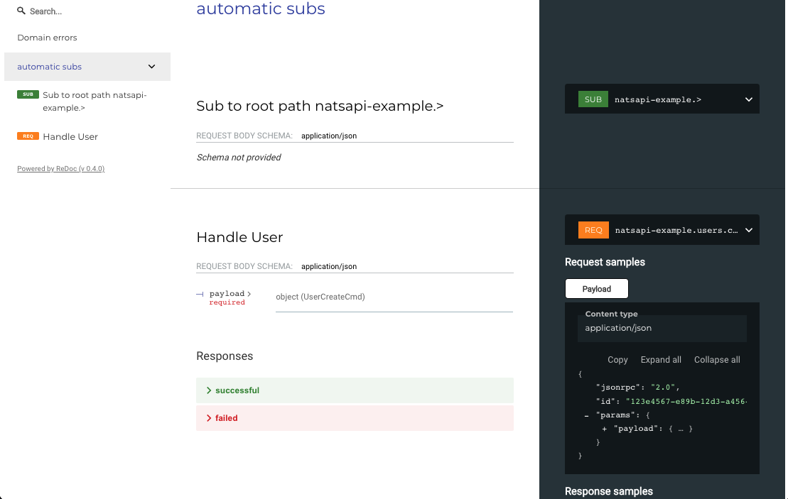

# NatsAPI

NatsAPI is a framework to develop Python3 applications that uses [nats](https://nats.io) as communication medium instead of http. With nats you have a smaller footprint, faster req/s, pub/sub and better observability.
NatsAPI is highly inspired by [FastAPI](https://github.com/tiangolo/fastapi) and has the same development style. NatsAPI produces an [AsyncAPI](https://www.asyncapi.com/) schema out of the box, **this schema is not fully compatible with the standard waiting for [version 3.0.0 to support request/reply pattern](https://github.com/asyncapi/spec/issues/94)**.

## Table of Contents

<!-- vim-markdown-toc GitLab -->

* [Installation](#installation)
* [Usage](#usage)
    * [Docs](#docs)
    * [Examples](#examples)
        * [Basic](#basic)
        * [Error handling with sentry](#error-handling-with-sentry)
    * [Generating documentation (asyncapi)](#generating-documentation-asyncapi)
    * [Plugins](#plugins)
    * [Roadmap](#roadmap)

<!-- vim-markdown-toc -->

## Python and pydantic support

This library has support for python > 3.9 and pydantic v1 and v2.

## Installation

```
$ pip install natsapi
```

## Usage

### Docs

> UNDER CONSTRUCTION

### Examples

#### Basic

```python
from natsapi import NatsAPI, SubjectRouter
from pydantic import BaseModel


class Message(BaseModel):
    message: str


class Person(BaseModel):
    first_name: str
    last_name: str


app = NatsAPI("natsapi")
router = SubjectRouter()


@router.request("persons.greet", result=Message)
async def greet_person(app: NatsAPI, person: Person):
    return {"message": f"Greetings {person.first_name} {person.last_name}!"}


app.include_router(router)

if __name__ == "__main__":
    app.run()
```

Run as follows:

```bash
$ python app.py
```

Docs will be rendered as:



Send a request:

```python
from natsapi import NatsAPI
import asyncio


async def main():
    app = await NatsAPI("client").startup()

    params = {"person": {"first_name": "Foo", "last_name": "Bar"}}
    r = await app.nc.request("natsapi.persons.greet", params=params, timeout=5)
    print(r.result)

asyncio.run(main())

#> {'message': 'Greetings Foo Bar!'}
```

or on the command line

```shell
$ nats request natsapi.persons.greet '{"params": {"person": {"first_name": "Foo", "last_name": "Bar"}}}'                                                                                                    

18:19:00 Sending request on "natsapi.persons.greet"
18:19:00 Received on "_INBOX.dpBgTyG9XC5NhagdqRHTcp.eMkVkru8" rtt 1.052463ms
{"jsonrpc": "2.0", "id": "c2bc2d20-dbd5-4e39-a22d-c22a8631c5a3", "result": {"message": "Greetings Foo Bar!"}, "error": null}
```

#### Error handling with sentry


```python
from natsapi import NatsAPI, SubjectRouter
import logging
from pydantic import ValidationError
from sentry_sdk import configure_scope
from natsapi.models import JsonRPCRequest, JsonRPCError
from pydantic import BaseModel


class StatusResult(BaseModel):
    status: str


app = NatsAPI("natsapi-example")

router = SubjectRouter()


@router.request("healthz", result=StatusResult)
async def handle_user(app: NatsAPI):
    return {"status": "OK"}


app.include_router(router)


def configure_sentry(auth):
    with configure_scope() as scope:
        scope.user = {
            "email": auth.get("email"),
            "id": auth.get("uid"),
            "ip_address": auth.get("ip_address"),
        }


@app.exception_handler(ValidationError)
async def handle_validation_exception(exc: ValidationError, request: JsonRPCRequest, subject: str) -> JsonRPCError:
    auth = request.params.get("auth") or {}
    configure_sentry(auth)
    logging.error(
        exc,
        exc_info=True,
        stack_info=True,
        extra={"auth": auth, "json": request.dict(), "subject": subject, "NATS": True, "code": -32003},
    )

    return JsonRPCError(code=-90001, message="VALIDATION_ERROR", data={"error_str": str(exc)})


if __name__ == "__main__":
    app.run(reload=False)
```

### Generating documentation (asyncapi)

To see the documentation, you can use the binary to run the server. Root path is `natsapi-example` so:

```bash
$ ./nats-redoc 4222 master.trinity-testing

Server running
Docs can be found on localhost:8090
connected to nats on port 4222
```

When surfing to [localhost:8090](http://127.0.0.1:8090), the documentation should look like this:



### Plugins

Plugins can be added and are found in `natsapi/plugin.py`.

- [natsapi_mock](./natsapi/plugin.py): A handy mock fixture to intercept nats requests and to fake nats responses for any subject.

### Roadmap

- [ ] Add Request/Reply AsyncApi support
- [ ] Hot reloading (when saving source code, application should be reloaded)
- [ ] Fancy readme
- [ ] Better benchmark
- [ ] Add support for 'side effect' testing so that you can have more than 1 response for same mocked route, based on ordering. See respx
- [ ] Better CI/CD -> with Python 3.13
- [ ] Make `nkeys` optional
- [x] Pydantic V2 support (nice to have)
